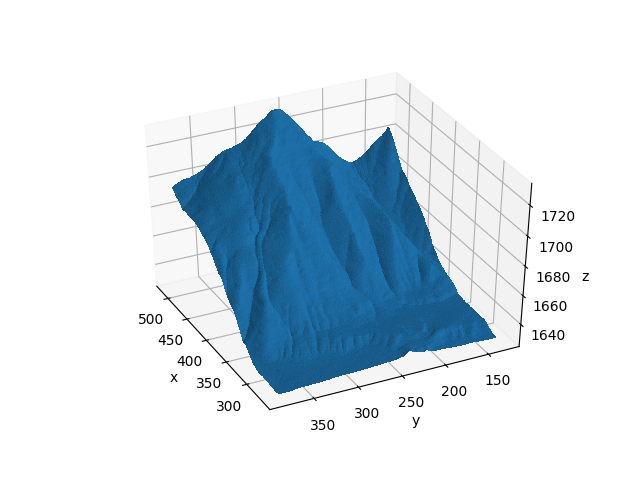
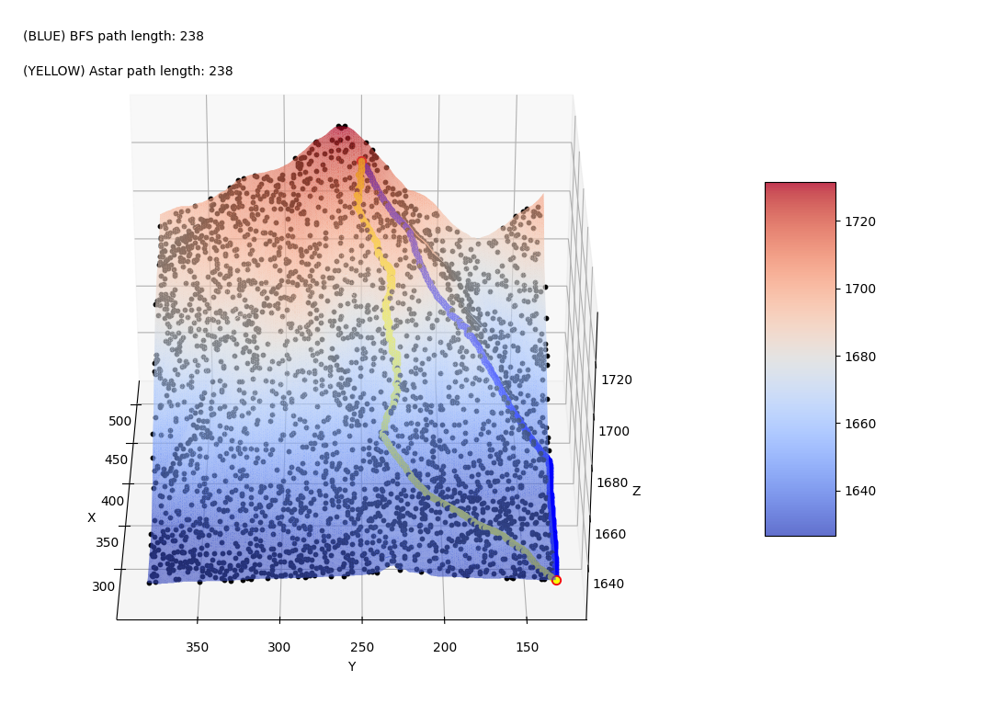

# Route Finder With A\* On 3D Map

The task is a classic path-finding problem, the aim of which is to determine the optimal route between two arbitrarily fixed points in a closed,
3-dimensional environment.

During the search, an intelligent agent moves on the surface of a surface. The coordinates (x, y) of the points on the surface fill an N x N square
grid, and there are obstacles at certain points on the surface. The agent initially starts from the START position and aims to move on the surface
to the designated END position, avoiding obstacles on the surface. In one step, you can move from the current position to one of the allowed
adjacent points. A point on the surface has 8 neighbors (two points on the surface are adjacent if the coordinates of the points (x, y) are
adjacent on the 2-dimensional square grid).

Given:

-   the file surface.txtView in a new window, which contains the points of the surface.
    Each line of the file is x y z b, where the triple (x, y, z) denotes the coordinates of a point on the surface, while b = 1 if that point is an
    obstacle, otherwise b = 0.
-   the points.txtView in a new window, which contains the coordinates of the START and END points.

Tasks:

1. Determine the minimum number of steps by which we can get from the START point to the end point. Write out the optimal route for the minimum
   number of steps.
2. Determine the path of minimum length between the two endpoints. To do this:

-   Write a distance calculator function that determines the Euclidean distance of two 3-dimensional points.
-   We implement the search algorithm A \*, where the cost of the distance traveled is equal to the sum of the lengths of the sections connecting
    the points of the route.

Questions:

-   Define the state space of the task and the best representation mode for it.
    Define states, transitions, start state and end state.
-   What method can we use to solve Problem 1?
-   What will be the cost function for the A \* algorithm, and what heuristics can we use to optimize the search?
-   What is the advantage of the A \* algorithm over other search methods?
